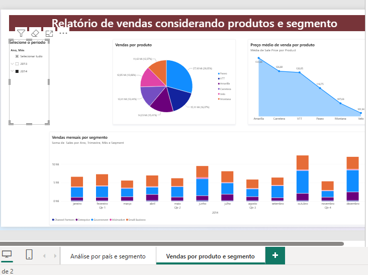
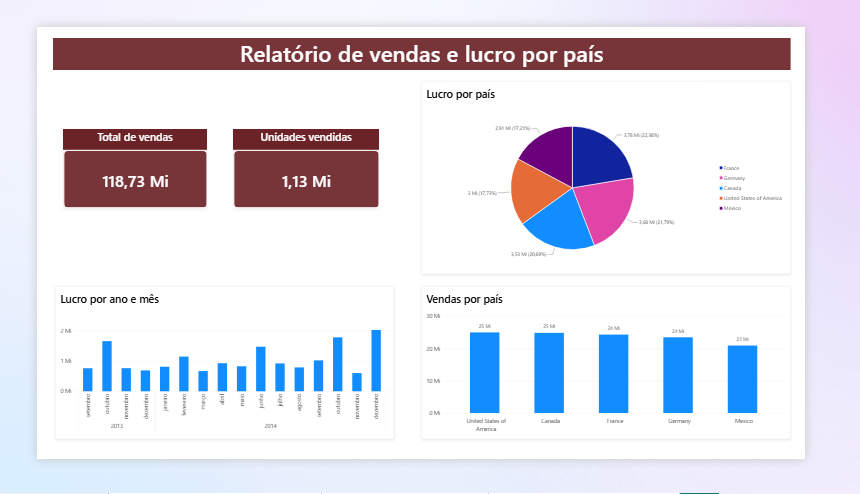
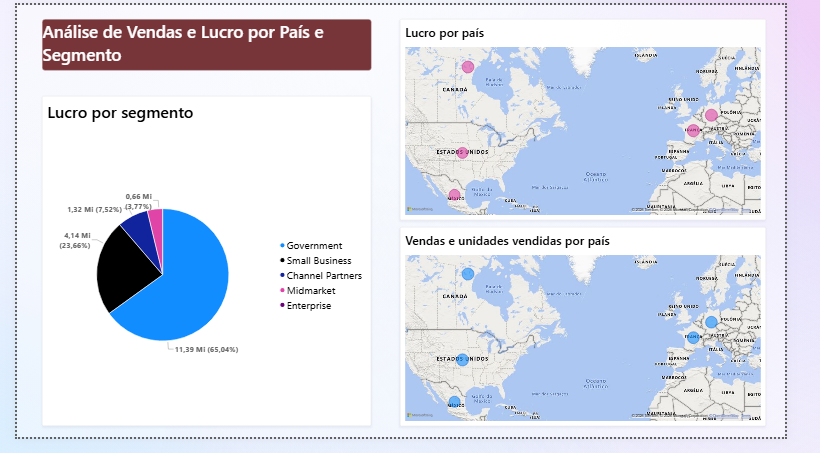

# Relatório Financeiro em Power BI

Projeto desenvolvido como parte do desafio de **Análise de Dados com Power BI** da [Digital Innovation One (DIO)](https://www.dio.me/).

O relatório utiliza a base **Financial Sample** para analisar vendas, lucro, unidades vendidas, produtos, segmentos e distribuição geográfica. O projeto contém três páginas interativas, com segmentação temporal, cartões de indicadores, gráficos comparativos e mapas.

## Visão geral

- **Total de vendas:** 118,73 milhões
- **Unidades vendidas:** 1,13 milhão
- **Lucro total:** 16,89 milhões
- **Registros analisados:** 700
- **Período:** 2013 a 2014

## Páginas do relatório

### 1. Vendas por produto e segmento

- vendas por produto;
- preço médio de venda por produto;
- vendas mensais por segmento;
- filtro hierárquico por ano e mês.



### 2. Vendas e lucro por país

- cartões com vendas totais e unidades vendidas;
- lucro por país;
- evolução mensal do lucro;
- comparação das vendas entre países.



### 3. Análise por país e segmento

- mapa de vendas e unidades vendidas por país;
- mapa de lucro por país;
- gráfico de lucro por segmento;
- dicas de ferramentas para consulta dos valores geográficos.



## Estrutura do repositório

```text
.
├── data/
│   └── sample_financial.pbix
├── images/
│   ├── vendas-produtos-segmentos.png
│   ├── vendas-lucro-pais.png
│   └── analise-pais-segmento.png
├── Relatorio_Financeiro_PowerBI_DIO.pbix
├── Relatorio_Financeiro_PowerBI_DIO.pdf
├── LICENSE
└── README.md
```

## Tecnologias e recursos utilizados

- Microsoft Power BI Desktop
- Power Query
- Microsoft Excel
- gráficos de pizza, área e colunas
- cartões de indicadores e mapas
- hierarquia de datas e segmentação de dados
- agregações de vendas, lucro e unidades vendidas
- formatação e organização de dashboards

## Como visualizar

1. Baixe o arquivo `Relatorio_Financeiro_PowerBI_DIO.pbix`.
2. Abra-o no **Power BI Desktop**.
3. Navegue pelas três páginas e utilize os filtros e dicas de ferramentas.

Para uma visualização estática, consulte `Relatorio_Financeiro_PowerBI_DIO.pdf`.

## Publicação

A publicação no Power BI Service e a exportação direta para PowerPoint não foram realizadas porque o serviço exige uma conta corporativa ou educacional. O projeto foi disponibilizado em **PBIX** e **PDF** para permitir sua visualização e avaliação.

## Base e referência

- Dataset: **Financial Sample**, disponibilizado para o desafio.
- Repositório de referência: [julianazanelatto/power_bi_analyst](https://github.com/julianazanelatto/power_bi_analyst)
- Relatório PBIX de referência do curso: `data/sample_financial.pbix`

## Autor

Desenvolvido por **Daniel Messeder**.

[GitHub](https://github.com/Messeder-Daniel)
